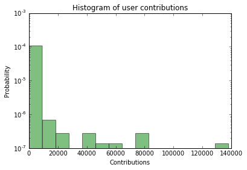

# OpenStreetMap Sample Project
### Data Wrangling with MongoDB
*Sergei Silnov*

Map Area: Everett, WA, USA
[Source area](http://www.openstreetmap.org/export#map=10/47.9389/-122.3534)

## Problems Encountered in the Map
After running simple tests on street names for the dataset I’ve found several problems:

Street names:
* Mistypes, example: Steet instead of Street, `u'Steet': {u'West Dayton Steet'}`
* Abbreviations instead of full names: St, ST, `u'St': {u'190th St'}`
* Bad order of address: `u'106th Lane Northeast'` instead of `u'Northeast 106th Lane'`


### Phone numbers
After review of phone numbers:
```
phones = db.everett.find({"phone": { "$exists": True }})
for doc in phones:
    print doc['phone']
```
I've found several formats of phone numbers used in database:

Without country code:
* 206 365 3211
* (360) 805-5495
* 425-485-1769
* 4257881167

With country code:
* +1-425-488-2795
* +1 425 744-1181
* +1 425 263 8180
* +1 425 532 utah

Because OSM is international service and according to (North American Numbering Plan)[https://en.wikipedia.org/wiki/North_American_Numbering_Plan] best option is
write all numbers in one format with country code and space as separator: **+1 xxx xxx xxxx**
For formatting I wrote this function:

```python
def format_phone(phone):
    # Remove all not meaning symbols:     
    phone = phone.encode('ascii','ignore').translate(None, '-_ ()')

    # Add country code '+1'
    if len(phone) == 10:
        phone = '+1' + phone

    # Add '+' if bare country code
    if len(phone) == 11:
        phone = '+' + phone

    # Add spaces for readability
    if len(phone) == 12:
        phone = phone[0:2] + ' ' + phone[2:5] + ' ' + phone[5:8] + ' ' + phone[8:]

    return phone
```

### Amenitites and cuisines
There are number of amenities with different Cuisines
All cafes, restaurants, fast foods, and pubs count:

| Amenity type | Count |
| ---- | ---- |
| restaurant | 257 |
| fast_food | 159 |
| cafe | 90 |
| pub | 24 |


Number of amenities with cuisine specified:

| Amenity type | Count |
| ---- | ---- |
| restaurant | 131 |
| fast_food | 93 |
| cafe | 35 |
| None | 6 |
| pub | 2 |


Problems in cuisines:

Different variants in writing:
* vietnamese
* Vietnamese_food


Lists in one field:
* sandwiches, appetizers
* ice_cream;burger

Cleaning was performed in 2 steps:
1. Split combined fields to array elements
2. Update variants: lowercase, remove `_food`


```python
#Fix cuisine
def format_cuisine(cuisines):
    if not isinstance(cuisines, list):
        cuisines = [cuisines]

    out_cuisines = []
    for cuisine in cuisines:
        # Lowercase     
        cuisine = cuisine.encode('ascii','ignore').lower()

        # Remove spaces
        cuisine = cuisine.translate(None, ' ')

        # Remove suffixes
        for suffix in cuisine_suffix:
            cuisine = cuisine.replace(suffix, '')

        # Replace separators to coma
        cuisine = cuisine.replace(';', ',')

        cuisine = cuisine.split(',')

        for el in cuisine:
            out_cuisines.append(el)

    return out_cuisines

# Update cuisines
cuisines = db.everett.aggregate([{"$match": {"cuisine": { "$exists": True }}},
                                 {"$match": {"amenity": { "$in": ['restaurant', 'fast_food', 'cafe', 'pub']}}}])
for doc in cuisines:
    new_cuisine = format_cuisine(doc["cuisine"])
    db.everett.update_one({'_id': doc['_id']}, {"$set": { 'cuisine': new_cuisine}})

```

## Data overview
This section contains general info about the dataset.
File sizes:

* everett.osm 154.8 MB
* everett.osm.json 164.9 MB

### Nodes count

```
db.everett.find().count()  
```

total records: 726667

```
db.everett.find({"type":"node"}).count()
```

node: 648750

```
db.everett.find({"type":"way"}).count()
```

way: 77910

### Users

```
total_users = len(db.everett.distinct("created.user"))
```

total editors: 798


## Additional ideas

Top 10 contributors:

```python
top_10 = db.everett.aggregate([{"$group":{"_id":"$created.user", "count":{"$sum":1}}},
                             {"$sort":{"count":-1}},
                             {"$limit":10}])
top_10_sum = 0 # Contributions by to 10 users
for doc in top_10:
  top_10_sum += doc['count']
  print(doc)
```

```
{u'count': 137861, u'_id': u'SeattleImport'}
{u'count': 81156, u'_id': u'Glassman_Import'}
{u'count': 74552, u'_id': u'seattlefyi_import'}
{u'count': 61620, u'_id': u'STBrenden'}
{u'count': 47758, u'_id': u'Natfoot'}
{u'count': 41735, u'_id': u'Glassman'}
{u'count': 36935, u'_id': u'Heptazane'}
{u'count': 26208, u'_id': u'compdude'}
{u'count': 21789, u'_id': u'bdp'}
{u'count': 18174, u'_id': u'joelotz'}
```

Top 10 contributors made huge part of changes. Using this code `float(top_10_sum)/total_records*100`
it is easy to see, that top 10 contributors make more than 75% percent of changes.

```python
# Number of users with 1 contribution
only_contribution_users = db.everett.aggregate([{"$group":{"_id":"$created.user", "count":{"$sum":1}}},
                                                 {"$group":{"_id":"$count", "num_users":{"$sum":1}}},
                                                 {"$sort":{"_id":1}},
                                                 {"$limit":1}]).next()['num_users']
100.0*only_contribution_users/total_users
```
And 236 users (29.6%) made the only contribution. Distribution is cleaner on histogram:


So, most users not very involved in editing this data. Maybe gamification techniques can improve the situation. Application of these techniques should be focused on users with small number of contributions, to encourage them contribute more.
Good example of

It is possible to make better data using other map services:

* Google Maps
* Bing Maps

But there are legal limitations in data by different commercial providers.

Another good sources of data are different social networks. Data about venues can be fetched from Foursquare using their public API (and https://github.com/mLewisLogic/foursquare library for python). For proof of concept I developed function, that search venue in Foursquare by location and name from OSM database.

```python
def fs_venue(elem):
    ll = '{},{}'.format(elem['pos'][0], elem['pos'][1])
    query = elem['name']
    venues = fs_client.venues.search(params={"ll": ll, "query": query}).get("venues")
    if len(venues) > 0 :
        return venues[0]
    else:
        return None
```


Using data fetched by this function I added phone numbers to
Most obvious downside of this method is performance. Each request to Foursquare API takes about 500 ms, and getting data for small subset of my OSM database (~2000 amenities) took about 15 minutes.
Of course it is possible to make requests in parallel, that should improve performance.
But another negative moment that API allows only 5,000 requests per hours for free.

From the other hand data on Foursquare has high quality:
I tried to find phone numbers for amenities without them. I add phone numbers to 944 amenities from 1933 in subset.
Also we can use tags from Foursquare data to improve OSM or even add amenities that absent in OSM from Foursquare.
I believe that matching of data only using location (radius of several dozens meters) and name is not robust enough. Because name could be slightly different from source to source.  For example word order in name can be different, somewhere `'` and `"` can be omitted.
In simple case good helper is amenity type, but anywhere we have to build correspondence table between different types in different databases.  

## Conclusion
OSM data is great source of information about objects in any place on the Earth. From one hand provided data format is rich and quite suited for machine processing, from the other hand there are number of inaccuracies in data, which require additional work during analysis. Because these problems can be solved programmatically, I believe that most of them will be solved in future. Other way to beat the problem may be control of input data from users.
