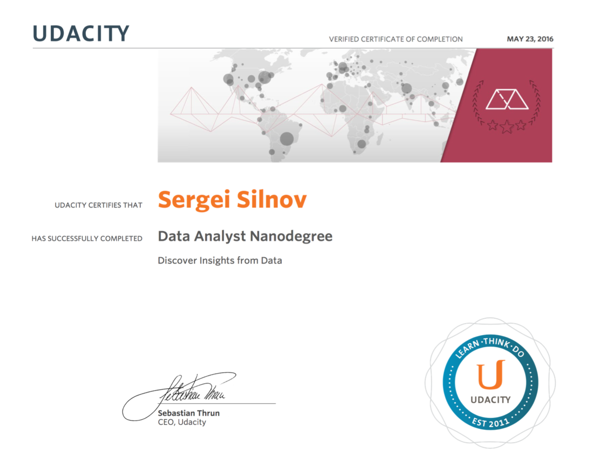

# Udacity Data Analyst Nanodegree projects
## by Sergei Silnov

Certificate:

Finished projects:

- Intro to Data Science
- Wrangle OpenStreetMap Data (Data Wrangling with MongoDB)
- Explore and Summarize Data (Data Analysis with R)
- Identify Fraud from Enron Email (Intro to Machine Learning)
- Data Visualization with D3.js
- Design an A/B Test
